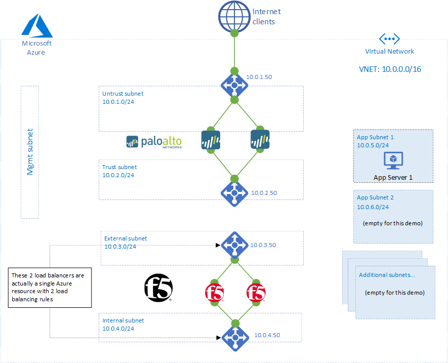
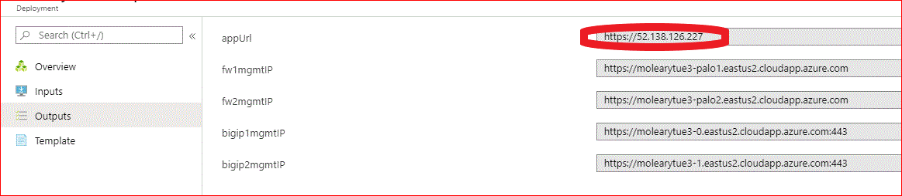
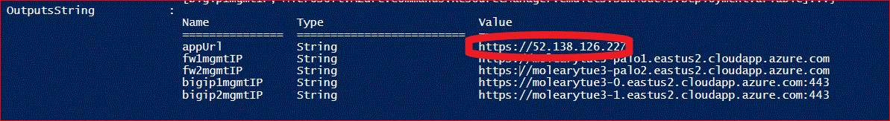

# azure-f5-palo
Deploys a security stack where PaloAlto firewalls are internet-facing, and F5 BIG-IP's perform application services in a second tier. Uses marketplace (PAYG) images so that license keys or eval keys are not required, but production or long-term use cases can edit the templates as desired to use BYOL licenses and license keys.

## Contents
- [Architecture](#Architecture)
- [Instructions to deploy](#Instructions-to-deploy)
- [High Availability](#High-Availability)
- [Notes](#Notes)
- [Advanced technical details for this demo](#Advanced-technical-details-for-this-demo)
- [Support](#Support)

## Architecture    

## Instructions to deploy
### Deploy via Web Interface
To deploy via the web interface, click the button below.

### Verify with URL from web interface
When the deployment is finished and you have <b>waited about 10 mins for the PaloAlto VM's to complete their bootstrap process</b> you can visit the URL of the application. Click on your Resource Group, then Deployments, then the Deployment you made, and it's Outputs. You should see a screen like below:  

### Deploy via Powershell
To deploy via Powershell, download the file Deploy_via_Powershell.ps1 and run a command similar to the following:
`.\Deploy_via_PS.ps1 -adminUsername azureuser -password MY-PASSWORD -dnsLabel SOME-UNIQUE-VALUE -resourceGroupName YOUR-RESOURCE-GROUP -region REGION`

### Verify with URL from Powershell outputs
When the deployment is finished and you have <b>waited about 10 mins for the PaloAlto VM's to complete their bootstrap process</b> you can visit the URL of the application. You should see a screen like below:  

## High Availability
This set of templates will automatically configure HA via Azure Load Balancers.
* The supported templates from F5 will configure HA via a Load Balancer, or via API. For this demo, I started with [this supported template from F5](https://github.com/F5Networks/f5-azure-arm-templates/tree/master/supported/failover/same-net/via-lb/3nic/new-stack/payg) which configures HA via Load Balancer, and I made a few modifications to the VNET to allow for the PaloAlto VM's to be deployed.

## Notes
* Do not use special/uppercase characters for your resource group name using the "deploy to Azure" button. Only lowercase and numbers.
* Restricted source address should be in the IP/CIDR Mask format.
* The Palo Alto VMs deployed requires a default Azure subscription to increase quotas for "Regional Cores" from 10 to at least 18.
* This set of templates will deploy F5 BIG-IP and PaloAlto VM-Series images from marketplace images. This means you will be charged on a PAYG basis.
* To build templates for PaloAlto VMs, I have started with a sample from PaloAlto's examples [here](https://github.com/PaloAltoNetworks/azure/tree/master/vmseries-avset) and made some modifications to deploy 2 VMs with external and internal load balancers, as well as bootstrap the devices.
* To build templates for F5 VM's, I have started with the supported F5 template [here](https://github.com/F5Networks/f5-azure-arm-templates/tree/master/supported/failover/same-net/via-lb/3nic/new-stack/payg) but made some modifications to this template in order to build out a full demo environment. 

## Advanced technical details for this demo
* PaloAlto have a reference architecture guide for Azure published [here](https://www.paloaltonetworks.com/resources/guides/azure-architecture-guide).
* PaloAlto VM's can be bootstrapped by configuring the CustomData field in the ARM template, which contains the details of an Azure file share that contains special configuration files. The instructions for this from PaloAlto are [here](https://docs.paloaltonetworks.com/vm-series/8-1/vm-series-deployment/bootstrap-the-vm-series-firewall/bootstrap-the-vm-series-firewall-in-azure). 
  * The major hurdle to this is the requirement of an existing Storage Account configured with a Files service (not a Blob service) that is required by PaloAlto VM's.
  * In order to access an Azure file server, [you must use a Storage Account Key](https://docs.microsoft.com/en-us/azure/storage/files/storage-how-to-use-files-windows). You might prefer to pre-create a Storage Account with pre-defined configuration files for this task, but you would then be required to store a Storage Account Key in the code (or demo instructions) of your repo - a bad practice, even if the files are intended to be public facing. 
  * To overcome the above problem, this demo creates a StorageAccount as part of this template, and then runs an [azcopy command](https://docs.microsoft.com/en-us/azure/storage/common/storage-ref-azcopy-copy) in an Azure container to copy the files required into the storage account. I followed [this helpful guide](https://samcogan.com/run-scripts-in-arm-deployments-with-aci) to do this, and then had my container run multiple commands using syntax I learned [here](https://docs.microsoft.com/en-us/azure/container-instances/container-instances-start-command#command-line-syntax).
  * The above steps are not recommended for production deployments, but it facilitates a demo deployment with a single click to deploy.
* F5 devices can be bootstrapped using declarative API's from the F5 Automation Toolchain family. In this case, we declare a configuration via a JSON-formatted declaration that is hosted [here.](https://github.com/mikeoleary/azure-f5-palo/blob/master/templates/f5/baseline.json)
## Support
This template has been developed for example and demonstration purposes. Please submit an issue via GitHub if you would like a feature added or have problems deploying this yourself.
